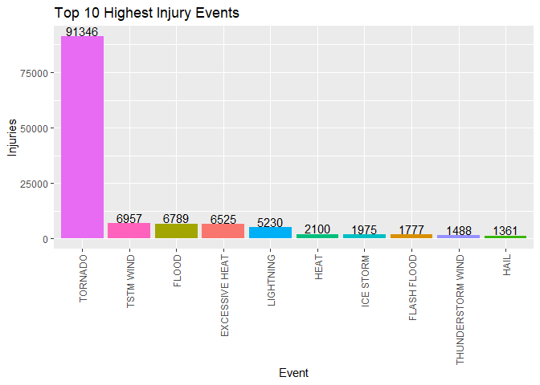
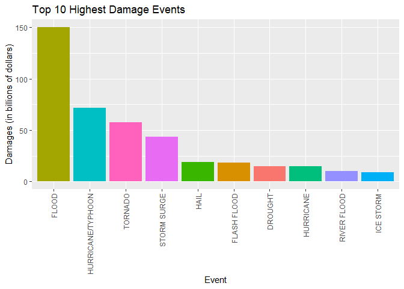

## Synopsis

Storms and other severe weather events cause both public health and economic problems for communities and municipalities within the United States. Many severe events can result in fatalities, injuries, and property damage, and preventing such outcomes to the extent possible is a key concern.

This project involves exploring the U.S. National Oceanic and Atmospheric Administration's (NOAA) storm database.

The analysis addresses the following questions:

1. Across the United States, which types of events are most harmful with respect to population health?
2. Across the United States, which types of events have the greatest economic consequences?

According to the analysis, the results are:

1. **Tornados** are the most harmful with respect to population health.
2. **Floods** have the greatest economic consequences.

---

## Data Processing  

The following packages will be used:

```r
#Load necessary packages
library(plyr)
library(dplyr)
library(ggplot2)
```

Download and read file containing the original data set.


```r
#download file

filename <- "repdata_data_StormData.csv.bz2"

if (!file.exists(filename)) {
        fileURL <- "https://d396qusza40orc.cloudfront.net/repdata%2Fdata%2FStormData.csv.bz2"
        download.file(fileURL, destfile = filename)
}

#read file
stormdata <- read.csv(filename)
```

Take a quick look at the data, and see if it is possible to subset the data frame.

```r
names(stormdata)
```

```
##  [1] "STATE__"    "BGN_DATE"   "BGN_TIME"   "TIME_ZONE"  "COUNTY"    
##  [6] "COUNTYNAME" "STATE"      "EVTYPE"     "BGN_RANGE"  "BGN_AZI"   
## [11] "BGN_LOCATI" "END_DATE"   "END_TIME"   "COUNTY_END" "COUNTYENDN"
## [16] "END_RANGE"  "END_AZI"    "END_LOCATI" "LENGTH"     "WIDTH"     
## [21] "F"          "MAG"        "FATALITIES" "INJURIES"   "PROPDMG"   
## [26] "PROPDMGEXP" "CROPDMG"    "CROPDMGEXP" "WFO"        "STATEOFFIC"
## [31] "ZONENAMES"  "LATITUDE"   "LONGITUDE"  "LATITUDE_E" "LONGITUDE_"
## [36] "REMARKS"    "REFNUM"
```

```r
head(stormdata)
```

```
##   STATE__           BGN_DATE BGN_TIME TIME_ZONE COUNTY COUNTYNAME STATE  EVTYPE
## 1       1  4/18/1950 0:00:00     0130       CST     97     MOBILE    AL TORNADO
## 2       1  4/18/1950 0:00:00     0145       CST      3    BALDWIN    AL TORNADO
## 3       1  2/20/1951 0:00:00     1600       CST     57    FAYETTE    AL TORNADO
## 4       1   6/8/1951 0:00:00     0900       CST     89    MADISON    AL TORNADO
## 5       1 11/15/1951 0:00:00     1500       CST     43    CULLMAN    AL TORNADO
## 6       1 11/15/1951 0:00:00     2000       CST     77 LAUDERDALE    AL TORNADO
##   BGN_RANGE BGN_AZI BGN_LOCATI END_DATE END_TIME COUNTY_END COUNTYENDN
## 1         0                                               0         NA
## 2         0                                               0         NA
## 3         0                                               0         NA
## 4         0                                               0         NA
## 5         0                                               0         NA
## 6         0                                               0         NA
##   END_RANGE END_AZI END_LOCATI LENGTH WIDTH F MAG FATALITIES INJURIES PROPDMG
## 1         0                      14.0   100 3   0          0       15    25.0
## 2         0                       2.0   150 2   0          0        0     2.5
## 3         0                       0.1   123 2   0          0        2    25.0
## 4         0                       0.0   100 2   0          0        2     2.5
## 5         0                       0.0   150 2   0          0        2     2.5
## 6         0                       1.5   177 2   0          0        6     2.5
##   PROPDMGEXP CROPDMG CROPDMGEXP WFO STATEOFFIC ZONENAMES LATITUDE LONGITUDE
## 1          K       0                                         3040      8812
## 2          K       0                                         3042      8755
## 3          K       0                                         3340      8742
## 4          K       0                                         3458      8626
## 5          K       0                                         3412      8642
## 6          K       0                                         3450      8748
##   LATITUDE_E LONGITUDE_ REMARKS REFNUM
## 1       3051       8806              1
## 2          0          0              2
## 3          0          0              3
## 4          0          0              4
## 5          0          0              5
## 6          0          0              6
```

```r
str(stormdata)
```

```
## 'data.frame':	902297 obs. of  37 variables:
##  $ STATE__   : num  1 1 1 1 1 1 1 1 1 1 ...
##  $ BGN_DATE  : Factor w/ 16335 levels "1/1/1966 0:00:00",..: 6523 6523 4242 11116 2224 2224 2260 383 3980 3980 ...
##  $ BGN_TIME  : Factor w/ 3608 levels "00:00:00 AM",..: 272 287 2705 1683 2584 3186 242 1683 3186 3186 ...
##  $ TIME_ZONE : Factor w/ 22 levels "ADT","AKS","AST",..: 7 7 7 7 7 7 7 7 7 7 ...
##  $ COUNTY    : num  97 3 57 89 43 77 9 123 125 57 ...
##  $ COUNTYNAME: Factor w/ 29601 levels "","5NM E OF MACKINAC BRIDGE TO PRESQUE ISLE LT MI",..: 13513 1873 4598 10592 4372 10094 1973 23873 24418 4598 ...
##  $ STATE     : Factor w/ 72 levels "AK","AL","AM",..: 2 2 2 2 2 2 2 2 2 2 ...
##  $ EVTYPE    : Factor w/ 985 levels "   HIGH SURF ADVISORY",..: 834 834 834 834 834 834 834 834 834 834 ...
##  $ BGN_RANGE : num  0 0 0 0 0 0 0 0 0 0 ...
##  $ BGN_AZI   : Factor w/ 35 levels "","  N"," NW",..: 1 1 1 1 1 1 1 1 1 1 ...
##  $ BGN_LOCATI: Factor w/ 54429 levels "","- 1 N Albion",..: 1 1 1 1 1 1 1 1 1 1 ...
##  $ END_DATE  : Factor w/ 6663 levels "","1/1/1993 0:00:00",..: 1 1 1 1 1 1 1 1 1 1 ...
##  $ END_TIME  : Factor w/ 3647 levels ""," 0900CST",..: 1 1 1 1 1 1 1 1 1 1 ...
##  $ COUNTY_END: num  0 0 0 0 0 0 0 0 0 0 ...
##  $ COUNTYENDN: logi  NA NA NA NA NA NA ...
##  $ END_RANGE : num  0 0 0 0 0 0 0 0 0 0 ...
##  $ END_AZI   : Factor w/ 24 levels "","E","ENE","ESE",..: 1 1 1 1 1 1 1 1 1 1 ...
##  $ END_LOCATI: Factor w/ 34506 levels "","- .5 NNW",..: 1 1 1 1 1 1 1 1 1 1 ...
##  $ LENGTH    : num  14 2 0.1 0 0 1.5 1.5 0 3.3 2.3 ...
##  $ WIDTH     : num  100 150 123 100 150 177 33 33 100 100 ...
##  $ F         : int  3 2 2 2 2 2 2 1 3 3 ...
##  $ MAG       : num  0 0 0 0 0 0 0 0 0 0 ...
##  $ FATALITIES: num  0 0 0 0 0 0 0 0 1 0 ...
##  $ INJURIES  : num  15 0 2 2 2 6 1 0 14 0 ...
##  $ PROPDMG   : num  25 2.5 25 2.5 2.5 2.5 2.5 2.5 25 25 ...
##  $ PROPDMGEXP: Factor w/ 19 levels "","-","?","+",..: 17 17 17 17 17 17 17 17 17 17 ...
##  $ CROPDMG   : num  0 0 0 0 0 0 0 0 0 0 ...
##  $ CROPDMGEXP: Factor w/ 9 levels "","?","0","2",..: 1 1 1 1 1 1 1 1 1 1 ...
##  $ WFO       : Factor w/ 542 levels ""," CI","$AC",..: 1 1 1 1 1 1 1 1 1 1 ...
##  $ STATEOFFIC: Factor w/ 250 levels "","ALABAMA, Central",..: 1 1 1 1 1 1 1 1 1 1 ...
##  $ ZONENAMES : Factor w/ 25112 levels "","                                                                                                               "| __truncated__,..: 1 1 1 1 1 1 1 1 1 1 ...
##  $ LATITUDE  : num  3040 3042 3340 3458 3412 ...
##  $ LONGITUDE : num  8812 8755 8742 8626 8642 ...
##  $ LATITUDE_E: num  3051 0 0 0 0 ...
##  $ LONGITUDE_: num  8806 0 0 0 0 ...
##  $ REMARKS   : Factor w/ 436781 levels "","-2 at Deer Park\n",..: 1 1 1 1 1 1 1 1 1 1 ...
##  $ REFNUM    : num  1 2 3 4 5 6 7 8 9 10 ...
```

The following variables will be defined and used for further analysis in order to answer the questions:

- EVTYPE: Event Type
- FATALITIES: Number of Fatalities
- INJURIES: Number of Injuries
- PROPDMG: Property Damage
- PROPDMGEXP: Unit of Porperty Damage (K, B, M)* 
- CROPDMG: Crop Damage
- CROPDMGEXP: Unit of Crop Damage (K, B, M)*

***Note**: As specified by the National Weather Service Storm Data Documentation, "Estimates should be rounded to three significant digits, followed by an alphabetical character signifying the magnitude of the number... Alphabetical characters used to signify magnitude include “K” for thousands, “M” for millions, and “B” for billions." 


```r
#subset variables specified above
data_sub <- select(stormdata, c("EVTYPE", "FATALITIES", "INJURIES", "PROPDMG", "PROPDMGEXP", "CROPDMG", "CROPDMGEXP"))

str(data_sub)
```

```
## 'data.frame':	902297 obs. of  7 variables:
##  $ EVTYPE    : Factor w/ 985 levels "   HIGH SURF ADVISORY",..: 834 834 834 834 834 834 834 834 834 834 ...
##  $ FATALITIES: num  0 0 0 0 0 0 0 0 1 0 ...
##  $ INJURIES  : num  15 0 2 2 2 6 1 0 14 0 ...
##  $ PROPDMG   : num  25 2.5 25 2.5 2.5 2.5 2.5 2.5 25 25 ...
##  $ PROPDMGEXP: Factor w/ 19 levels "","-","?","+",..: 17 17 17 17 17 17 17 17 17 17 ...
##  $ CROPDMG   : num  0 0 0 0 0 0 0 0 0 0 ...
##  $ CROPDMGEXP: Factor w/ 9 levels "","?","0","2",..: 1 1 1 1 1 1 1 1 1 1 ...
```

Looking at the output from `str(data_sub)`, `PROPDMGEXP` and `CROPDMGEXP` are factor variables (expected), but they have more than 3 levels (unexpected). 


```r
unique(data_sub$PROPDMGEXP)
```

```
##  [1] K M   B m + 0 5 6 ? 4 2 3 h 7 H - 1 8
## Levels:  - ? + 0 1 2 3 4 5 6 7 8 B h H K m M
```

```r
unique(data_sub$CROPDMGEXP)
```

```
## [1]   M K m B ? 0 k 2
## Levels:  ? 0 2 B k K m M
```

These variables will be refactored due to possible input error. (See **Note** above.) The factor levels will be changed according to the following:

- K, M, B levels will be changed to their numeric values; 10^3, 10^6, 10^9, respectively.

- "?", "-", "+" will have a value of 0

- "", "0" will have a value of 1.


```r
data_sub$PROPDMGEXP <- mapvalues(data_sub$PROPDMGEXP, from = levels(data_sub$PROPDMGEXP), to = c(1, 0, 0, 0, 1, 10, 10^2, 10^3, 10^4, 10^5, 10^6, 10^7, 10^8, 10^9, 10^2, 10^2, 10^3, 10^6, 10^6))

data_sub$CROPDMGEXP <- mapvalues(data_sub$CROPDMGEXP, from = levels(data_sub$CROPDMGEXP), to = c(1, 0, 1, 10^2, 10^9, 10^3, 10^3, 10^6, 10^6))
```

Now multiply the property and crop damages by their respective exponent column, in order to find the total values for property damage and crop damage. 


```r
#Calculate total property damage
data_sub$PROPDMGEXP <- as.numeric(as.character(data_sub$PROPDMGEXP)) #change to character and then numeric to perserve exponent
data_sub <- mutate(data_sub, PROPDMG.TOTAL = PROPDMG * PROPDMGEXP)

#Calculate total crop damage
data_sub$CROPDMGEXP <- as.numeric(as.character(data_sub$CROPDMGEXP)) #change to character and then numeric to perserve exponent
data_sub <- mutate(data_sub, CROPDMG.TOTAL = CROPDMG * CROPDMGEXP)
```

The `data_sub` data frame will now be used for analysis in order to answer the stated questions.

---

## Analysis & Results

### Which events are most harmful to population health?

The data from the `INJURIES` and `FATALITIES` variables indicate impact to public health. A boxplot will display the event type with its associated injuries and fatalities.


```r
data_sub %>%
        select(INJURIES, EVTYPE) %>%
        group_by(EVTYPE) %>%
        summarise(injury = sum(INJURIES)) %>%
        top_n(n = 10, wt = injury) %>% #filter out top 10 events wrt injury
        ggplot(aes(x = reorder(EVTYPE, -injury), y = injury, fill = EVTYPE)) + #reorder barplot to plot injury in descending order
        geom_bar(stat = "identity", show.legend = FALSE) +
        labs(x = "Event", y = "Injuries", title = "Top 10 Highest Injury Events") +
        geom_text(aes(label=injury), size = 4, hjust = 0.5, vjust = -0.1) + #add totals on top of each bar
        theme(axis.text.x = element_text(angle = 90, vjust = 0.5, hjust=1)) #rotate yaxis labels
```

<!-- -->

Looking at the graph, `TORNADO` events have caused the most injuries at 91,346.

Now for fatalities:


```r
data_sub %>%
        select(FATALITIES, EVTYPE) %>%
        group_by(EVTYPE) %>%
        summarise(fatality = sum(FATALITIES)) %>%
        top_n(n = 10, wt = fatality) %>%
        ggplot(aes(x = reorder(EVTYPE, -fatality), y = fatality, fill = EVTYPE)) +
        geom_bar(stat = "identity", show.legend = FALSE) +
        labs(x = "Event", y = "Fatalities", title = "Top 10 Highest Fatality Events") +
        geom_text(aes(label=fatality), size = 4, hjust = 0.5, vjust = -0.1) +
        theme(axis.text.x = element_text(angle = 90, vjust = 0.5, hjust=1))
```

<!-- -->

Looking at the graph, `TORNADO` events have caused the most fatalities at 5,633.

**Therefore, it is concluded that `TORNADO` events are the most harmful with respect to public health.**

### Which events have the greatest economic consequences?

The data from the `PROPDMG.TOTAL` and `CROPDMG.TOTAL` variables indicate total propoerty and crop damage, respectively. To illustrate economic impact, a boxplot plotting event type and **combined** property and crop damages will be created.


```r
data_sub %>%
        select(PROPDMG.TOTAL, CROPDMG.TOTAL, EVTYPE) %>% 
        #combine crop and prop damages
        group_by(EVTYPE) %>%
        summarise(damage = sum(PROPDMG.TOTAL + CROPDMG.TOTAL)/10^9) %>% 
        #divide by 10^9 to look at damages in billions of dollars
        top_n(n = 10, wt = damage) %>% #filter out top 10 events wrt injury
        ggplot(aes(x = reorder(EVTYPE, -damage), y = damage, fill = EVTYPE)) +
        geom_bar(stat = "identity", show.legend = FALSE) +
        labs(x = "Event", y = "Damages (in billions of dollars)", title = "Top 10 Highest Damage Events") +
        theme(axis.text.x = element_text(angle = 90, vjust = 0.5, hjust=1))
```

<!-- -->

Looking at the graph, `FLOOD` events have caused the most damages at about $150 billion.

### Results

According to the analysis,

1. Across the United States, **tornados** are the most harmful with respect to population health.
2. Across the United States, **floods** have the greatest economic consequences.
